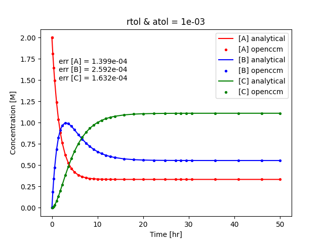
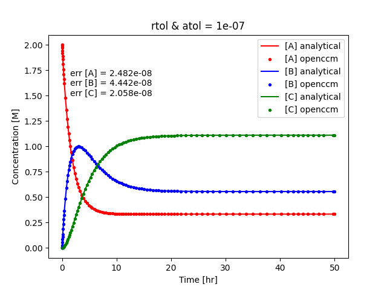
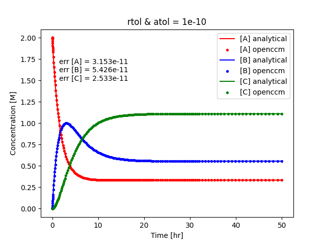
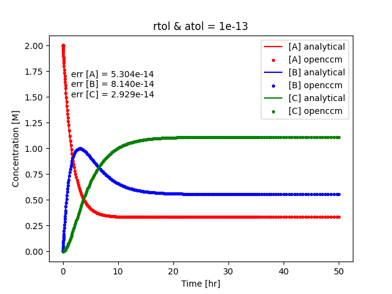

# CSTR Example: Irreversible Linear Reactions

## Reaction System

This problem closely follows that of Example 8.3/8.4 from *H. Scott Fogler - Elements of Chemical Reaction Engineering, 5th ed.* but includes the transient derivation and solutions.

Suppose we have the following irreversible coupled linear reaction system: 
$$ A \rightarrow B $$
$$ B \rightarrow C $$
with first-order kinetic rate constants $k_1 = 0.5$ $hr^{-1}$ and $k_2 = 0.2$ $hr^{-1}$ respectively. 

The reaction rates are easily derived, and are:
$$ r_A = -k_1 C_A $$
$$ r_B = k_1 C_A - k_2 C_B $$
$$ r_C = k_2 C_B $$

## CSTR Mass Balance

A transient mass balance for a species $P$ in a CSTR is as follows. 
$$ \frac{dN_P}{dt} = F_{in} - F_{out} + Vr_P $$
$$ V\frac{dC_P}{dt} = Q P_{IN} - QC_P + Vr_P $$
$$ \frac{dC_P}{dt} = \frac{P_{IN}}{\tau} - \frac{C_P}{\tau} + r_P $$
where $N_P$ is the number of moles, $F$ represents the molar flow rate in $mol/s$, $V$ is the volume of the CSTR, $r_P$ is the reaction rate, and $C_P$ and $P_{IN}$ represent the concentration of species $P$ and the inlet feed rate respectively.
Solving for constant volume $V$ and volumetric feed rate $Q$ allows for simplifications as shown above, where $\tau = \frac{V}{Q}$.

### Mass Balance for $A$

Using the formula above, the mass balance for species $A$ is: 
$$ \frac{dC_A}{dt} = \frac{A_{IN}}{\tau} - \frac{C_A}{\tau} -k_1 C_A$$

This is a first order ODE that is easily solved by the integrating factor method. 
Let $\alpha_A = \frac{A_{IN}}{\tau}$ and $\beta_A = \frac{k_1\tau + 1}{\tau} $.
$$ \frac{dC_A}{dt} + \beta_A C_A = \alpha_A $$
$$ \frac{d}{dt}(C_A e^{\beta_A t}) = \alpha_A e^{\beta_A t} $$
$$ C_A(t) = \frac{\alpha_A}{\beta_A} + \gamma e^{-\beta_A t} $$

Note both the initial condition ($C_{A0}$) and inlet feed rate ($A_{IN}$) = 2M. 
Applying the initial condition yields $\gamma = A_{IN} - \frac{\alpha_A}{\beta_A}$. 
After some simplifications, we obtain the analytical transient mass balance expression for $A$: 
$$ C_A(t) = \frac{A_{IN}}{1+ k_1\tau} (1+ k_1\tau e^{-\beta_A t}) $$

### Mass Balance for $B$

For $B$, the initial concentration ($C_{B0}$) and inlet feed rate ($B_{IN}$) are both 0M. Therefore the mass balance is:
$$ \frac{dC_B}{dt} = \frac{-C_B}{\tau} + k_1C_A - k_2C_B $$

We will now define $\beta_B = \frac{k_2\tau + 1}{\tau}$.
The mass balance for $B$ can now be written as:
$$ \frac{dC_B}{dt} = -\beta_B C_B + k_1\alpha_A + k_1^2 \tau \alpha_A e^{-\beta_A t} $$

Again the integrating factor method is used to solve for the transient profile of $B$: 
$$ \frac{dC_B}{dt} + \beta_B C_B =  k_1\alpha_A + k_1^2 \tau \alpha_A e^{-\beta_A t} $$
$$ \frac{d}{dt}(C_B e^{\beta_B t}) = k_1\alpha_A e^{\beta_B t} + k_1^2 \tau \alpha_A e^{(\beta_B-\beta_A) t} $$
$$ C_B(t) = \frac{k_1\alpha_A}{\beta_B} + \frac{k_1^2 \tau \alpha_A}{\beta_B - \beta_A} e^{-\beta_A t} + \gamma e^{-\beta_B t} $$

Implementing the initial condition $C_{B0} = 0M$ and solving for $\gamma$, the resulting mass balance is 
$$ C_B(t) = \frac{k_1 \alpha_A}{\beta_B}(1-e^{-\beta_B t}) + \frac{k_1^2 \tau \alpha_A}{\beta_B - \beta_A} (e^{-\beta_A t} - e^{-\beta_B t}) $$

### Mass Balance for $C$

Species $C$ is similar to $B$ in that the initial concentration ($C_{C0}$) and inlet feed rate ($C_{IN}$) are both 0M. 
The mass balance is 
$$ \frac{dC_C}{dt} + \frac{C_c}{\tau} = k_2 C_B $$

Again, the integrating factor method is used to solve the ODE:
$$ C_c e^{t/\tau} = \frac{k_2 k_1 \alpha_A}{\beta_B} \int dt e^{t/\tau} - e^{t(1/\tau - \beta_B)} + 
        \frac{k_2 k_1^2 \tau \alpha_A}{\beta_B - \beta_A} \int dt e^{t (1/\tau - \beta_A)} - e^{t(1/\tau - \beta_B)} $$

After some trivial integration we have the mass balance:
$$ C_c(t) = \gamma e^{-t/\tau} + \frac{k_2 k_1 \alpha_A}{\beta_B}
    \left(\tau - \frac{e^{-\beta_B}t}{1/\tau - \beta_B}\right) \frac{k_2 k_1^2 \tau \alpha_A}{\beta_B - \beta_A} 
                \left(\frac{e^{-\beta_A t}}{1/\tau - \beta_A} - \frac{e^{-\beta_B t}}{1/\tau - \beta_B}\right) $$

The constant of integration $\gamma$ is found through the initial condition $C_{C0} = 0$, yielding 
$$ \gamma = \frac{k_2 k_1 \alpha_A}{\beta_B}\left(\frac{1}{1/\tau - \beta_B} - \tau\right) + \frac{k_2 k_1^2 \tau \alpha_A}{\beta_B - \beta_A}\left(\frac{1}{1/\tau - \beta_B} - \frac{1}{1/\tau - \beta_A}\right) $$

## Simulation Setup

Using the reaction system previously described, the following initial condtitions and inlet feed rates in units of [M] (concentration) employed for simulations are re-iterated here. 
Note that the final transient profiles for all species were derived using these values and not for generalized (variable) conditions.
$$ a_{BC} = a_0 = 2 $$
$$ b_{BC} = b_0 = 0 $$
$$ c_{BC} = c_0 = 0 $$

The solution vectors $sol^a$ (analytical) and $sol^n$ (OpenCCM) use the same specific timesteps given by the numerical solver.
The error between these two solutions for a species computed at each timestep $i$ for $N$ total timesteps is a normalized absolute error:
$$ err = \frac{\sum_i^N \lvert sol^a_i - sol^n_i \rvert}{N} $$

Simulations were run using varying tolerances of 1e-3, 1e-7, 1e-10, and 1e-13 for both absolute and relative tolerances.
Additionally, although stricter tolerances result in larger number of timesteps, this is accounted for in the error equation (normalization by $N$).

## Conclusions

In conclusion:
* OpenCCM's CSTR implementation can handle irreversible linear reactions as validated by comparison to an analytically derived mass balance system.
* Increasing the relative and absolute simulation tolerances significantly reduces the overall error between analytical and numerical solutions.
