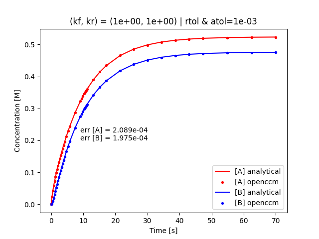
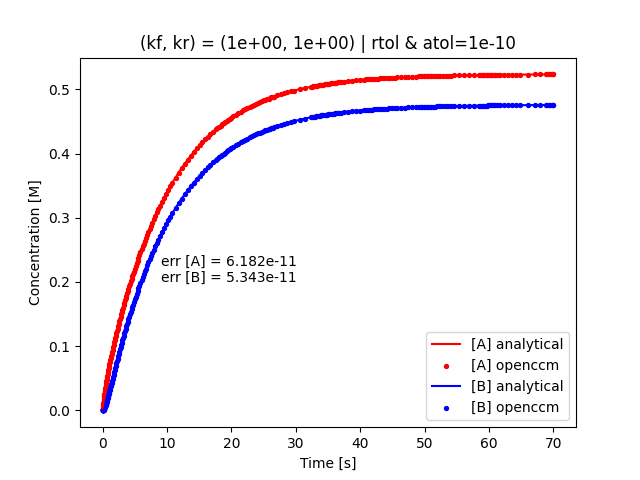
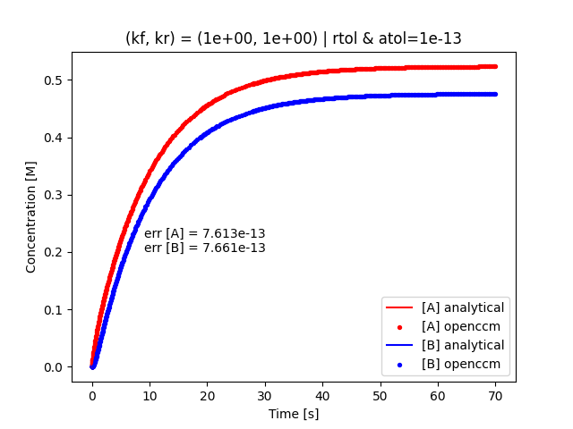

# CSTR Example: Reversible Linear Reaction

## Reaction System

Suppose we have the following reversible linear reaction: $$ A \leftrightarrow B$$ with first-order kinetic rate constants $k_f$ and $k_r$ for the forward and reverse reactions (respectively).

The reaction rates are easily derived, and are:
$$ r_A = k_rB - k_fA $$
$$ r_B = k_fA - k_rB $$

## CSTR Mass Balance

A transient mass balance for a species $P$ in a CSTR is as follows (note that herein the concentration as a function of time, $C_P(t)$, is shortened to just $P$ for brevity).
$$ \frac{dN_P}{dt} = F_{in} - F_{out} + Vr_P $$
$$ V\frac{dP}{dt} = Q P_{IN} - QP + Vr_P $$
$$ \frac{dP}{dt} = \frac{P_{IN}}{\tau} - \frac{P}{\tau} + r_P $$
where $N_P$ is the number of moles, $F$ represents the molar flow rate in $mol/s$, $V$ is the volume of the CSTR, $r_P$ is the reaction rate, and $P$ and $P_{IN}$ represent the concentration of species $P$ and the inlet feed rate respectively.
Solving for constant volume $V$ and volumetric feed rate $Q$ allows for simplifications as shown above, where $\tau = \frac{V}{Q}$.

### Mass Balance System

Using the formula above, the mass balance for species $A$ is: 
$$ \frac{dA}{dt} = \alpha A + k_r B + \frac{A_{IN}}{\tau} $$
where $\alpha = -k_f - 1/\tau$, and $A_{IN}$ represents the inlet feed rate for species $A$. 

Similarly the mass balance for species $B$ is:
$$ \frac{dB}{dt} = k_f A + \beta B + \frac{B_{IN}}{\tau} $$
where $\beta = -k_r - 1/\tau$, and $B_{IN}$ represents the inlet feed rate for species $B$. 

This is a coupled linear system of inhomogeneous ODEs.
By recognizing that $r_A = -r_B$, this allows for a simplified total conservation of mass expression.

We begin by noting the following definitions:
$$ C(t) = A(t) + B(t) $$
$$ C_{IN} = A_{IN} + B_{IN} $$
$$ C_0 = A_0 + B_0 $$

Now finding an expression for transient (total) conservation of mass:
$$ \frac{dC}{dt} = \alpha A + k_r B + \frac{A_{IN}}{\tau} + k_f A + \beta B + \frac{B_{IN}}{\tau} $$
$$ \frac{dC}{dt} = (\alpha + k_f)A + (\beta + k_r)B + \frac{A_{IN} + B_{IN}}{\tau} $$
$$ \frac{dC}{dt} = \frac{-C}{\tau} + \frac{C_{IN}}{\tau} $$

This equation is ideal for use of the integrating factor method to generate a general solution for $C(t)$:
$$ \frac{dC}{dt} + \frac{C}{\tau} = \frac{C_{IN}}{\tau} $$
$$ \frac{d}{dt}(Ce^{t/\tau}) =\frac{C_{IN}}{\tau} e^{t/\tau} $$
$$ Ce^{t/\tau} = \int \frac{C_{IN}}{\tau} e^{t/\tau} dt $$
$$ Ce^{t/\tau} = C_{IN}e^{t/\tau} + \gamma $$
$$ C(t) = C_{IN} + \gamma  e^{-t/\tau} $$

Using a generalized initial condition $C(t=0) = C_0 = C_{IN} + \gamma$, we find that $\gamma = C_0 - C_{IN}$.
We now have $C(t)$ in its final form:
$$ C(t) = C_{IN} + (C_0 - C_{IN}) e^{-t/\tau} $$

Returning to the governing ODE for species $A$ and inserting $B = C-A$, we have:
$$ A' = \alpha A + k_r (C-A) + \frac{A_{IN}}{\tau} $$
$$ A' = (\alpha- k_r)A + k_r C + \frac{A_{IN}}{\tau} $$

We now define some simplifications,
$$ \alpha^m = k_r - \alpha = k_r + k_f + \frac{1}{\tau} $$
$$ f(t) = k_r C_{IN} + k_r(C_0 - C_{IN}) e^{-t/\tau} + \frac{A_{IN}}{\tau} $$

of which now we can define our new governing ODE for species $A$:
$$ A' + \alpha^m A = f(t) $$

Again, this suggests use of the integrating factor method to obtain the general solution for $A(t)$:
$$ \frac{d}{dt}(Ae^{\alpha^m t}) = f(t)e^{\alpha^m t} $$
$$ Ae^{\alpha^m t} = \int f(t)e^{\alpha^m t} dt $$
$$ Ae^{\alpha^m t} = \int \left(k_r C_{IN} + \frac{A_{IN}}{\tau}\right)e^{\alpha^m t} + k_r(C_0 - C_{IN}) e^{t(\alpha^m - 1/\tau)} dt $$
$$ Ae^{\alpha^m t} = \frac{k_r C_{IN} + A_{IN}/(\tau)}{\alpha^m} e^{\alpha^m t} + \frac{k_r(C_0 - C_{IN}) e^{t(\alpha^m - 1/ \tau)}}{\alpha^m - 1/ \tau} + \omega $$
$$ \rightarrow A(t) = \frac{\left( k_r C_{IN} + A_{IN}/ \tau \right)}{\alpha^m} + \frac{k_r(C_0 - C_{IN}) e^{-t/ \tau}}{\alpha^m - 1/ \tau} + \omega e^{-\alpha^m t} $$

Inserting the general initial condition, $A(t=0) = A_0$, we solve for the constant $\omega$:
$$ A(0) = \frac{\left(k_r C_{IN} + A_{IN}/\tau \right)}{\alpha^m} + \frac{k_r(C_0 - C_{IN})}{\alpha^m - 1/ \tau} + \omega $$
$$ \rightarrow \omega = A_0 - \frac{\left(k_r C_{IN} + A_{IN}/\tau \right)}{\alpha^m} - \frac{k_r(C_0 - C_{IN})}{\alpha^m - 1/\tau} $$

At last we arrive at the complete expression for $A(t)$:
$$ A(t) = A_0e^{-\alpha^m t} + \frac{\left(k_r C_{IN} + A_{IN}/\tau \right)}{\alpha^m}\left(1-e^{-\alpha^m t} \right) + \frac{k_r(C_0 - C_{IN})}{\alpha^m - 1/\tau}\left(e^{-t/ \tau}-e^{-\alpha^m t} \right) $$

With this expression we can now obtain $B(t)$ as 
$$ B(t) = C(t) - A(t) $$

## Simulation Setup

Using the reaction system previously described, the following describes initial conditions and inlet feed rates in units of [M] (concentration) that were employed for simulations. 
$$ A_{0} = 0 $$
$$ B_{0} = 0 $$
$$ A_{IN} = 1 $$
$$ B_{IN} = 0 $$

This setup represents a CSTR with no initial chemical species present but includes a constant inlet feed rate of 1M for species $A$ which will induce reaction behaviour as time evolves. 

The solution vectors $sol^a$ (analytical) and $sol^n$ (OpenCCM) use the same specific timesteps given by the numerical solver.
The error between these two solutions for a species computed at each timestep $i$ for $N$ total timesteps is a normalized absolute error:
$$ err = \frac{\sum_i^N \lvert sol^a_i - sol^n_i \rvert}{N} $$

### Simulation for Small $k$

Simulations were run using varying tolerances of $10^{-3}$, $10^{-7}$, $10^{-10}$, and $10^{-13}$ for both absolute and relative tolerances using the following $k$ values:
$$ k_f = 1 \times 10^{-2} s^{-1} $$
$$ k_r = 1 \times 10^{-4} s^{-1} $$

Note that these constants were chosen arbitrarily to represent a system with dominant $A$ concentration over $B$ production. 
Additionally, although stricter tolerances result in larger number of simulation timesteps, this is accounted for in the error equation (normalization by $N$).

### Simulation for Large $k$

Simulations were run using varying tolerances of 1e-3, 1e-7, 1e-10, and 1e-13 for both absolute and relative tolerances using the following $k$ values:
$$ k_f = 1 s^{-1} $$
$$ k_r = 1 s^{-1} $$

Note that these constants were chosen arbitrarily to represent a system with near-equal steady state $A$ and $B$ concentrations. 
Additionally, although stricter tolerances result in larger number of simulation timesteps, this is accounted for in the error equation (normalization by $N$).

## Conclusions

In conclusion:
* OpenCCM's CSTR implementation can handle linear reversible reactions, both for relatively small or large $k$ kinetic rate constants, as validated by comparison to an analytically derived mass balance system.
* Increasing the relative and absolute simulation tolerances significantly reduces the overall error between analytical and numerical solutions.