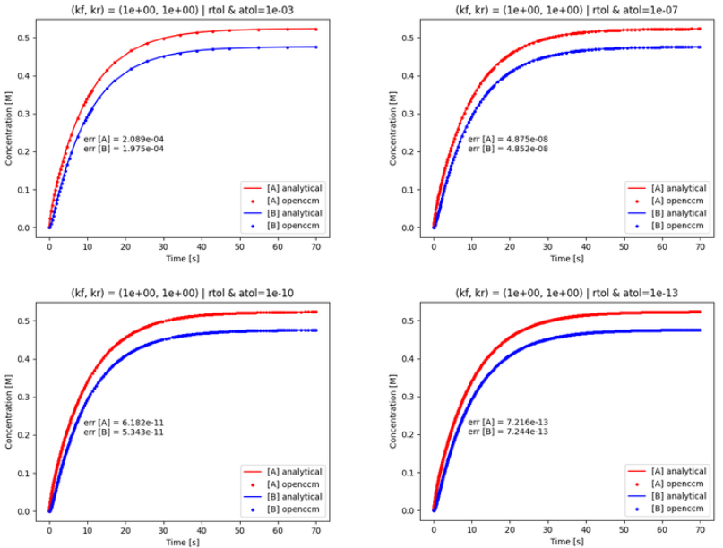
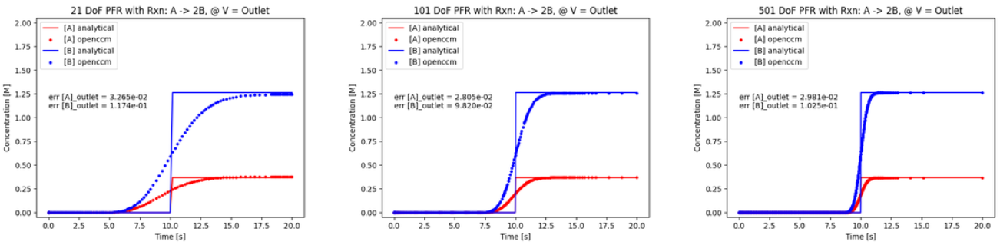

# Summary

OpenCCM is a compartmental modelling software package based on flow alignment [@Vasile2024]. It is primarily intended for flow-based processes where there is a weak coupling between any reactions and the flow in the system. OpenCCM 
integrates with both OpenCMP [@Monte2022] and OpenFOAM [@OpenFOAM] allowing for easy movement of data between this package and either of those. Additionally, it provides users with built-in functionality for calculating residence times, exporting to re-import into simulation software, and for exporting results for visualization using ParaView [@Ahrens2005].

OpenCCM development follows the principles of ease of use, performance, and extensibility. The configuration file-based user interface is intended to be concise, readable, and intuitive. Furthermore, the code base is structured and documented [@Vasile2024] and uses an internal mesh representation such that experienced users can add input-output bindings for their packages (e.g. FEniCS or ANSYS) with no modifications required to the main compartmental modelling code.

Compartmental modelling allow for significant computational speedups compared to full CFD simulations while still providing some information about the spatial variation within the domain. However, traditional approaches suffer from lack of generality, too much generality, lack of physical interpretability of results,
OpenCCM addresses these issues by providing a fully automated compartmental modelling method which handles the general class of flow problems through the use of a flow-based compartmentaliztion scheme and a higher-order PFR-in-series-based model for each compartment.
Further, the constructed model retains a one-to-one correspondence between locations within the compartment model and the original physical domain as well as built-in methods for mapping the results back onto the physical space, for both visualization purposes and for further simulations, i.e. allowing for multi-scale modelling.
rather than a well-mixed CSTR-based model.

# Statement of Need

While simulation-based design and analysis continues to provide valuable insights and revolutionize the engineering design process, many processes, especially in chemical engineering, are inherently challenging to simulate. For example, many processes in the pharmaceutical industry, bioreactors and crystalizers, contain very disparate time-scales necessitating simulations be performed with very small time-steps over very long time horizons. This imposes a significant computation cost which hampers or even limits the ability to use simulations for entire classes of problems. Compartment modelling is a form of reduced order modelling which is especially well-suited for such applications as they take advantage of those disparate time-scales in order to greatly simplify the system in the spatial domain; replacing the full CFD-domain by a network of compartments, each with a simplified set of governing equations.

However, there are several barrier to the more widespread us of compartment models. The biggest of which is the lack of software, open-source or otherwise, for automatically generating compartment models. There exists closed-source, AMBER [@Amber], for manually creating and solving well-mixed compartments networks, however it is cost-prohibitive to use and the lack of automatice compartmentalization severely limits its applicability for the use-cases of interest, i.e. engineering design and geometry iterations. There also exist open-source software, Cantera [@Cantera], for solving compartment networks, however it lacks the ability to build such a network given a simulation result. Further, neither of these software allow for importing CFD results and creating compartments based on those results, instead relying on expert knowledge to manually create and connect the compartments.
The only alternative up until now, as evidenced by the compartment modelling literature, has been to manually construct the compartments and manually write out the coupled ODE/PDEs representing the mass balances over the compartments.

The goal of OpenCCM is to fill this need for an open-source compartment modelling package which is user-friendly, compatible with a variety of simulation package backends, and which fits into the users existing simulation and post-processing pipeline. OpenCCM is built using the idea of a intermediary mesh and flow-field format allowing for the compartment modelling algorithm and spatial mapping to be simulation package agnostic, allowing users to import simulation results from their package of choice and exporting the results back into that same format. Currently support for OpenCMP and OpenFOAM is included. OpenCCM provides pre-implemented finite-difference based solvers for the resulting models and a configuration file-based user interface to allow the general simulation community to immediately take advantage of the benefits of such models, not just simulation experts. The user interface is designed to be intuitive, readable, and requires no programming experience - solely knowledge of the CLI. Users must choose between the CSTR- and PFR-based models, certain tolerances, and any reactions occurring the system but need no experience with the actual numerical implementation of the models or the mathematical derivation of net reaction rates.

# Features

| Feature                 | Description                                                                       |
|-------------------------|-----------------------------------------------------------------------------------|
| Model support           | Accepts OpenCMP [@Monte2021] and OpenFOAM [@OpenFOAM] results                     |
| Compartmentalization    | Single-phase flow-based compartment identification                                |
| Compartmental Modelling | PFR-in-series-based model                                                         |
|                         | Previous SotA CSTR-based models                                                   |
| CM Simulations          | Linear, non-linear, and reversible arbitrary reactions.                           |
|                         | 1st Order upwinding finite-difference-based                                       |
|                         | Adaptive time-stepping                                                            |
| Post-Processing         | Residence time distribution                                                       |
| Output                  | Intermediary mesh format                                                          |
|                         | Labeled compartments in Paraview format                                           |
|                         | Concentrations from CM simulations in both Paraview and simulation package format |
| Performance             | Multi-threading                                                                   |
|                         | Caching of intermediary results to speed-up subsequent runs                       |

Writing unit tests against an exact output is very difficult for a variety of reasons. First the method is inherently an approximation of the CFD simulation leading to expected differences between the original CFD result and the approximation. Further, while the method is automated it is nevertheless quite descriptive, providing criteria that the final result will meet and is sensitive to initial conditions, though the differing final results all have comparable performance. Thus, the majority of the software testing is provided through the use of extensive use of in-line asserts checking and enforcing of invariants and required properties at the beginning and end of most functions. The reaction system is tested against several analytic solutions, see the examples sections for more information.

# User Interface

The `OpenCCM` python package can be used via text-based configuration files centered around the CLI (command line interface). The software was designed such that each run would be in its own self-contained directory. This can either be a new directory created for the compartment model. In addition to the `OpenCCM` config files, the required contents of the directory depends on the simulation package being used. The package currently supports two open source simulation packages: `OpenCMP` and `OpenFOAM`.

For `OpenCMP` three files are required: 1) the `OpenCMP` config file, 2) the mesh on which the simulation was run, and 3) the .sol solution file that contains the velocity profile to use for creating the compartment model. The `OpenCCM` config file will specify the path of the `OpenCMP` config file and the `.sol` file, the location of the mesh file will be read from the `OpenCMP` config file.

For `OpenFOAM`, two directories are required: 1) the `constant` directory which contains the mesh information in ASCII format, and 2) a directory containing the simulation results to be used for creating the compartment model saved in ASCII format. The path to the solution directory is specified in the `OpenCCM` config, and the `constant` directory is assumed to be in the same parent folder.

After running, `OpenCCM` will create several directories:

The `.log` directory which contains detailed debugging information, if debug logging is enabled, about each step of the compartment modelling process.

The `.tmp` directory which contains intermediary files used for speeding up subsequent runs of the model. This includes the mesh and velocity vector fields converted to the intermediary format as well as the network of PFRs/CSTRs.

The `ouput_ccm` directory which contains `ParaView` files for visualizing the compartments as well as the simulation results from the compartment model, both in numpy format for further analysis and in either ParaView format or the native format of the simulation package that was originally used.

# Examples of Usage

Several examples are provided, which for the time being are all in 2D. These examples show the handling of both OpenCMP and OpenFOAM simulation results, as well as creating both PFR-based and CSTR-based compartmental models.
The geometry used in [@Vasile2024] is reproduced in both OpenCMP and OpenFOAM under the `OpenCMP/pipe_with_recirc_2d` and `OpenFOAM/pipe_with_recic` directories, respectively.

Also included in the `examples/simple_reactors` folder are two of the files needed to run OpenCMP-simulation based single CSTR and single PFR models for various reaction systems.
These two examples act as tutorials for how to imput reactions and a convergence/error analysis for linear, non-linear, coupled, and reversible reaction systems in CSTRs and/or PFRs.

Two specific examples using the implemented single CSTR and single PFR compartment models are discussed below in addition to a brief description of the custom reactions configuration file parser developed for OpenCCM. 

# Reaction Configuration File 

The reactions parser developed for OpenCCM reads and parses the reactions configuration files and can handle general reaction equations of the form `aA + bB + [...] -> cC + dD + [...]` with associated numeric rate constants. 
It intentionally does not support the standard `<->` symbol for reversible chemical reactions, so that each independent reaction has an explicit rate constant clearly defined in the same file. Therefore, a reversible reaction must be written as two independent forward reactions (with separate rate constants). 

Additionally, specie superscripts (i.e. ions) or subscripts (i.e. compounds) in traditional chemistry notation are not supported by the parser. Instead, each specie must solely contain letter characters (except for stoichiometric coefficients which may precede these characters). I.e., if the user wishes to use `O2`, it must be written as `O` or a dummy name such as `a` in the reactions configuration file.

The kinetic rate constants must be expressed as positive real numbers and the parser does support scientific notation for these values. Additionally, each reaction/rate pair must also have a unique *identifier*.
This identifier allows the parser to correctly associate a reaction/rate pair, and is allowed to be any alpanumeric value (i.e. R1, R2, etc.).

Additionally, the parser is robust such that it will flag any inappropriate use of the configuration setup. This includes:
* duplicate reactions, 
* reactions with missing rates, 
* rates with missing reactions,
* non-numeric rate values, and
* alphanumeric species (aside from stoichiometric prefixes)

The parser does not have a preference for the ordering of the configuration file (either [RATES] then [REACTIONS] or vice versa). Also, the specific reactions and rates themselves do not need to be in a specific order as long the identifiers are correct for each reaction/rate pair. 

## Example Configuration

Suppose the reversible reaction `2NaCl + CaCO3 <-> Na2CO3 + CaCl2` with `k_f = 5e-2` and `k_r` = 2 is used for simulations. These species must first be redefined in simple terms in agreement with the reactions parser, i.e. a = NaCl, b = CaCO3, c = Na2CO3, and d = CaCl2. A configuration file for this reversible reaction may then be:

    [REACTIONS]
    R1: 2a + b -> c + d
    R2: c + d -> 2a + b

    [RATES]
    R1: 5e-2
    R2: 2
  
where **R1** and **R2** are the reaction *identifiers* for the forward and reverse reactions respectively.

Multiple examples with different reactions have been developed for OpenCCM. Two specific examples using the CSTR and PFR compartment model implementations are summarized here.

# CSTR Example: Reversible Linear Reaction

This example demonstrates a mass balance simulation of OpenCCM's CSTR simple reactor using a reversible linear chemical reaction. The files for this example can be found [here](https://github.com/uw-comphys/openccm/tree/main/examples/simple_reactors).

## Mass Balance System

Suppose we have the following reversible linear reaction: $$ A \leftrightarrow B$$ with first-order kinetic rate constants $k_f$ and $k_r$ for the forward and reverse reactions (respectively).

Noting that $C(t) = A(t) + B(t)$ is an expression for the total conservation of mass, the total initial condition and inlet feed rate can be expressed as $C_0 = A_0 + B_0$ and $C_{IN} = A_{IN} + B_{IN}$ respectively. 

A full derivation of the transient mass balance equations is available [here](TODO-REF-LINK).
For brevity, the equations are stated here:

$$ C(t) = C_{IN} + (C_0 - C_{IN}) e^{-t/\tau} $$
$$ A(t) = A_0e^{-\alpha^m t} + \frac{\left(k_r C_{IN} + A_{IN}/\tau \right)}{\alpha^m}\left(1-e^{-\alpha^m t} \right) + \frac{k_r(C_0 - C_{IN})}{\alpha^m - 1/\tau}\left(e^{-t/ \tau}-e^{-\alpha^m t} \right) $$
and therefore
$$ B(t) = C(t) - A(t) $$
where $\tau = \frac{V}{Q}$ is the ratio of the constant volume to volumetric feed rate ($Q$), $\alpha = -k_f - 1/\tau$ is a constant, and $P_{IN}$ and $P_0$ represent the inlet feed rate and initial condition for species $P$ (respectively).

## Simulation Setup

The example directory has three main files: 
* **CONFIG** - specifies many input and simulation parameters, such as the compartment model, initial conditions, and inlet feed rates (referred to as boundary conditions in the configuration file).
* **reactions** - specifies the reactions involved in the system along with their associated kinetic rate constants.
* **cstr_analysis.py** - contains the code necessary to run this example. 

This example will use the previously described reaction system with initial conditions and inlet feed rates as follows (units of [M]):
$$ A_{0} = 0 $$
$$ B_{0} = 0 $$
$$ A_{IN} = 1 $$
$$ B_{IN} = 0 $$

and reaction rate constants of $k_f = k_r = 1$ $s^{-1}$. The code in **cstr_analysis.py** is setup to run this simulation for various absolute and relative simulation tolerances: 1e-3, 1e-7, 1e-10, and 1e-13. After running this Python file, the output is:

{ width=80% }

# PFR Example: Irreversible Linear Reaction

This example demonstrates a mass balance simulation of OpenCCM's PFR simple reactor using an irreversible linear chemical reaction. The files for this example can be found [here](https://github.com/uw-comphys/openccm/tree/main/examples/simple_reactors).

## Mass Balance System

Suppose we have the following irreversible linear reaction: $$ a \rightarrow 2b $$ with a first-order kinetic rate constant $k = 0.1$ $s^{-1}$.

A full derivation of the transient mass balance equations is available [here](TODO-REF-LINK) and makes good use of the Laplace Transform ($\mathscr{L}$). For brevity, the equations are stated here:

$$ a(V, t) = a_0 e^{-kt}(1-H(t-V/Q)) + a_{BC}e^{-kV/Q}H(t-V/Q) $$
$$ b(V, t) = \frac{2a_0 \left(1-H(t-V/Q)\right)}{\left(1-e^{-kt}\right)^{-1}} + H(t-V/Q) (2 a_{BC}(1-e^{-kV/Q}) + b_{BC} - b_0) + b_0$$

where $P_0$ and $P_{BC}$ represent the initial and boundary condition of species $P$ (respectively), and $H(t)$ is the *Heaviside* or unit step function. 

## Simulation Setup 

The example directory has three main files: 
* **CONFIG** - specifies many input and simulation parameters, such as the compartment model, initial conditions, and boundary conditions.
* **reactions** - specifies the reactions involved in the system along with their associated kinetic rate constants.
* **pfr_analysis.py** - contains the code necessary to run this example. 

This example will use the previously described reaction system with initial and boundary conditions as follows (units of [M]):
$$ a(0, t) = a_{BC} = 1 $$
$$ a(V, 0) = a_0 = 0 $$
$$ b(0, t) = b_{BC} = 0 $$
$$ b(V, 0) = b_0 = 0 $$

and a reaction rate constant of $k = 0.1$ $s^{-1}$. The code in **pfr_analysis.py** is setup to run this simulation for various PFR volume discretizations including 21, 101, and 501 points in the domain. The transient analysis is saved at the inlet, middle, and outlet volumetric points. After running this Python file, the *outlet* output is:

{ width=80% }

# Acknowledgements

This research was supported by the Natural Sciences and Engineering Research Council of Canada (NSERC) and the Digital Research Alliance of Canada.

# References
